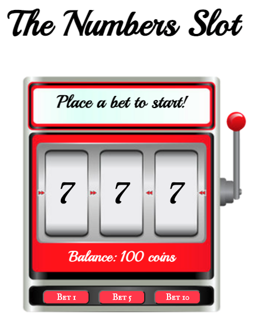

# Unit 1 Project- The Number Slots

A casino classic. Same look. Same feel. Same winning (or losing) odds. 

Play the game <a href="https://the-number-slots.netlify.app" rel="noopener noreferrer" target="_blank">here</a>! 

# Rules of the Game:
1) Input amount of coins (from 1 to 100) you have to play with.
2) Pick your bet. The more you bet, the more you win!
3) Once your balance reaches 0, it's game over!
4) Hit "Reset" to play again.
5) Repeat steps 1-4.

**Payout**:
  <ul>
    <li>Betting 1 coin, wins 2 </li>
    <li>Betting 5 coins, wins 11 </li>
    <li>Betting 10 coins, wins 25</li>
  </ul>

# Screenshots

# Technologies Used
<ul>
  <li>HTML</li>
  <li>CSS</li>
  <li>Javascript</li>
</ul>

# Credits
Background image: <a href="https://stock.adobe.com/sk/search/images?k=slot+machine+blank" rel="noopener noreferrer" target="_blank">Adobe Stock</a>
 
Audio: <a href="https://quicksounds.com/library/sounds/slot-machine" rel="noopener noreferrer" target="_blank">Quick Sounds</a>
 
Fonts: <a href="https://fonts.google.com/" rel="noopener noreferrer" target="_blank">Google Fonts</a>

# Next Steps
<ul>
  <li>Add scoreboard</li>
  <li>Add bonus rounds</li>
  <li>Add Bitcoin wallet integration</li>
</ul>

